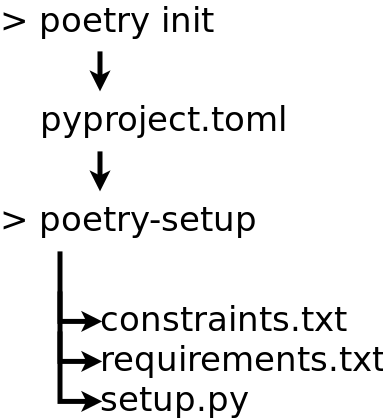

# poetry-setup


[](https://travis-ci.org/orsinium/poetry-setup) [](https://pypi.org/project/poetry-setup/) [](https://github.com/orsinium/poetry-setup/blob/master/LICENSE)


**DEPRECATION WARNING:** poetry-setup is deprecated, use [DepHell](https://github.com/dephell/dephell) instead. It can do all these things ([dephell deps convert](https://dephell.readthedocs.io/en/latest/cmd-deps-convert.html) command) and much more.


Make your [poetry](https://poetry.eustace.io/) project backward compatible.

This tool generate some files from [pyproject.toml](https://poetry.eustace.io/docs/pyproject/):
* [setup.py](https://packaging.python.org/tutorials/packaging-projects/#creating-setup-py)
* [requirements.txt](https://pip.pypa.io/en/stable/user_guide/#requirements-files)
* [constraints.txt](https://pip.pypa.io/en/stable/user_guide/#constraints-files) (from optional dependencies)



## Installation

I'm recommend use [pipsi](https://github.com/mitsuhiko/pipsi) for all console scripts like this.

Install via pipsi:

```bash
pipsi install poetry-setup
```

Install via pip:

```bash
pip install poetry-setup
```

Install via poetry:

```bash
poetry install poetry-setup
```


## Usage

```bash
poetry-setup [path/to/project/]
```

Generate for project in current dir:

```bash
poetry-setup
```

Generate for project in `example` dir:

```bash
poetry-setup example
```

## What about pipenv?

Pipenv can generate `Pipfile` from `requirements.txt`.

## Run test

```bash
pipenv install
pipenv shell
python -m pytest tests.py
```
